# 👋 Pingy - Social Media Web Application

A modern, responsive social media web application built with React Vite and Tailwind CSS, featuring real-time interactions and comprehensive social networking capabilities.

## 🛠️ Technology Stack

- **Frontend Framework**: React with Vite
- **Styling**: Tailwind CSS
- **Authentication**: Clerk Auth
- **Icons**: Lucide React

## 🎨 Key Components

- **Authentication Flow** - Secure login with Clerk
- **Story Component** - Ephemeral content sharing
- **Post Component** - Social media posts with interactions
- **Messaging Interface** - Real-time chat system
- **Profile Editor** - User profile customization
- **Search & Discovery** - Advanced user/content discovery

## 🔧 Available Scripts

- `npm run dev` - Start development server

## 🌟 Highlights

- **Responsive Design** - Optimized for all devices
- **Real-time Interactions** - Live updates
- **Modern UI/UX** - Clean, intuitive interface
- **Performance Optimized** - Fast loading with Vite

## 🚀 Getting Started

### Prerequisites
- Node.js 16+ 
- npm or yarn

### Installation

1. **Clone the repository**

2. **Install dependencies**
   npm install

3. **Environment Setup**
   Create a `.env` file and add your Clerk credentials:
   ```env
   VITE_CLERK_PUBLISHABLE_KEY=your_clerk_publishable_key
   VITE_CLERK_SECRET_KEY=your_clerk_secret_key
   ```

4. **Start development server**
   npm run dev

5. **Open your browser**
   Navigate to `http://localhost:5173`

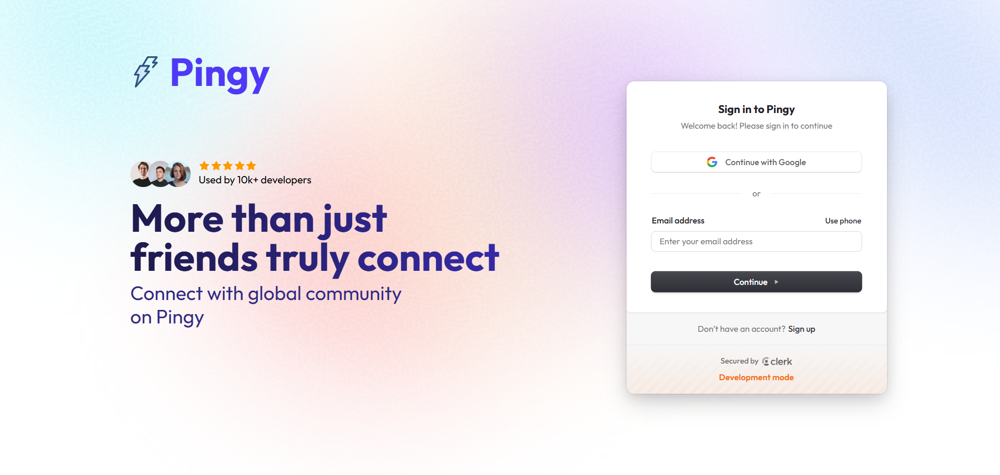 

## ✨ Features

### 🔐 Authentication & User Management

- **Secure Sign In/Sign Out** with Clerk authentication
- **Google OAuth integration** for seamless login

 
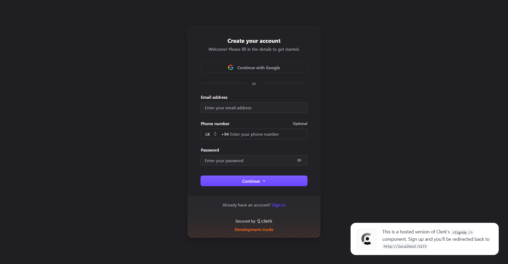 

- **Multi-account support** and account management

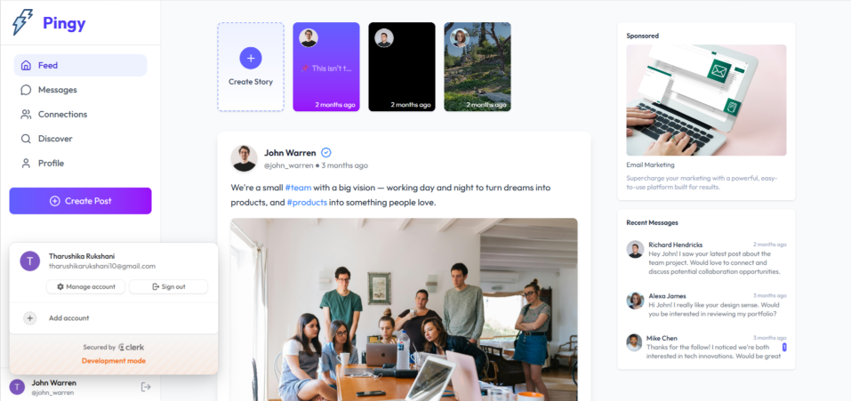 
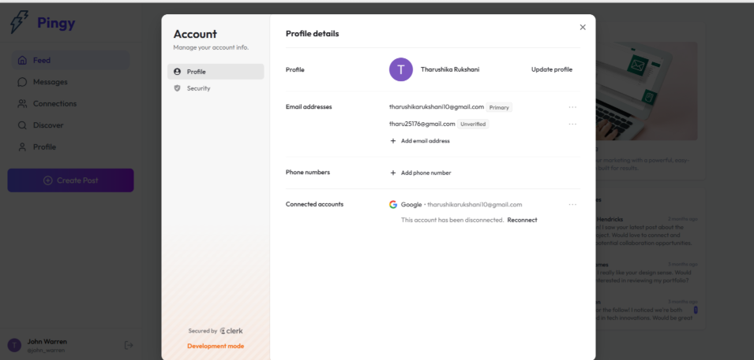 

- **Profile management** with edit capabilities


### 📱 Core Social Features

- **Story Creation** - Create and view ephemeral stories (types- photo, video, text)

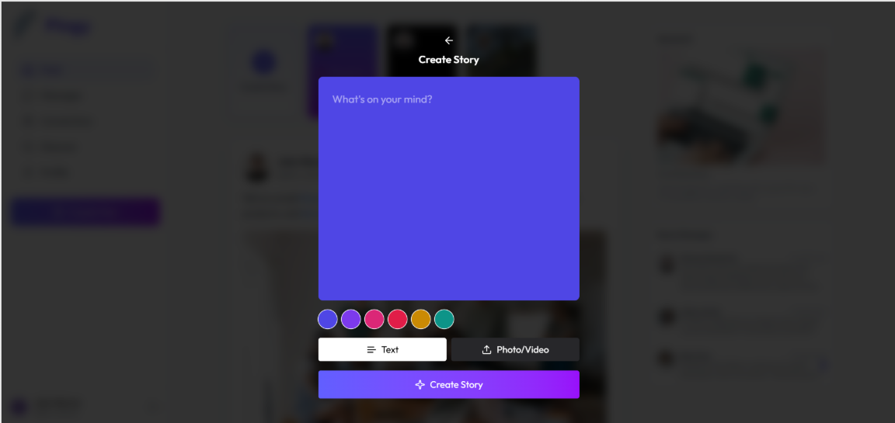 
 
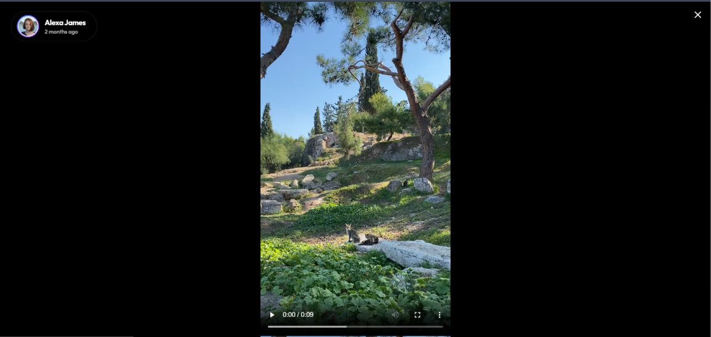 

- **Post Management**

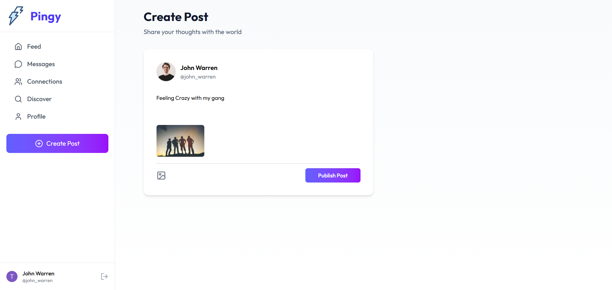 
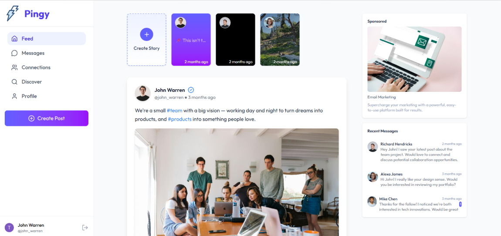 

- **Engagement Tools** - Like, comment, and share functionality
- **Real-time Updates** - Live interactions and notifications

 
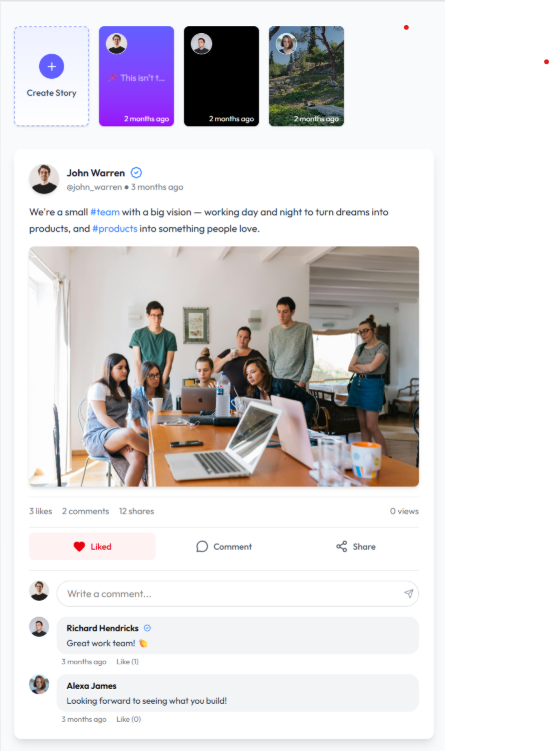 

### 👥 Social Connections

- **Connection System** - Followers, Following, Pending requests

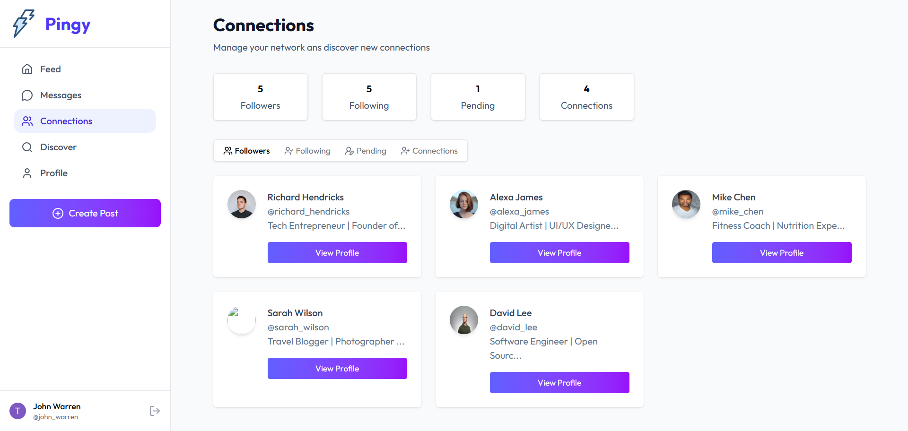 
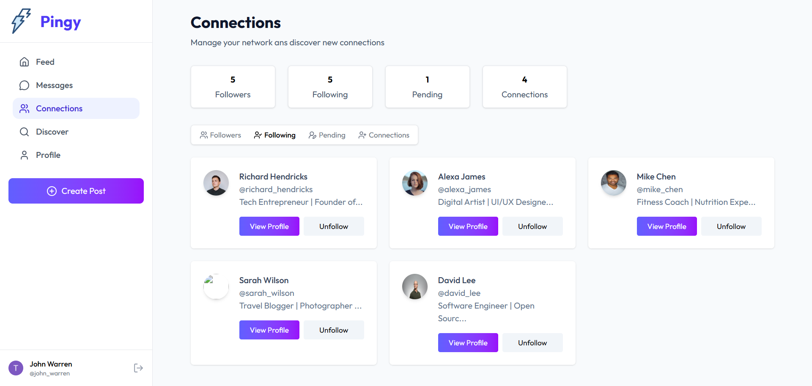 
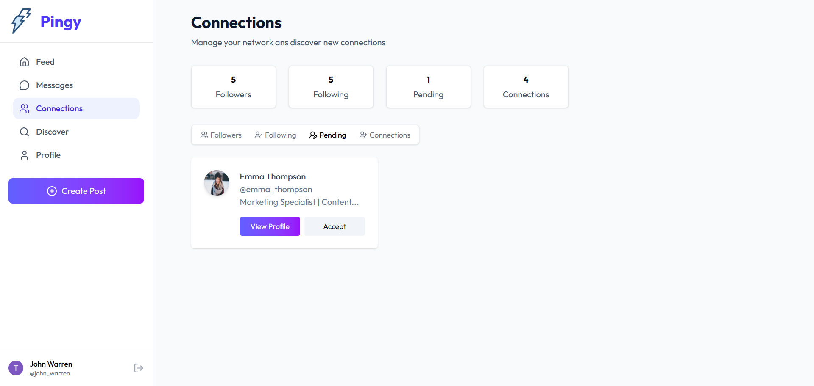 
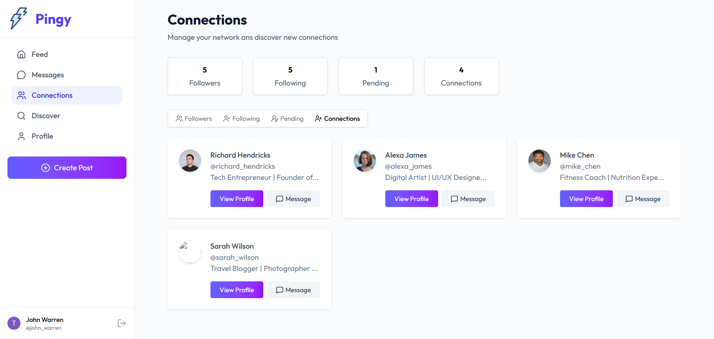

- **Connection Requests** - Send and manage friend requests

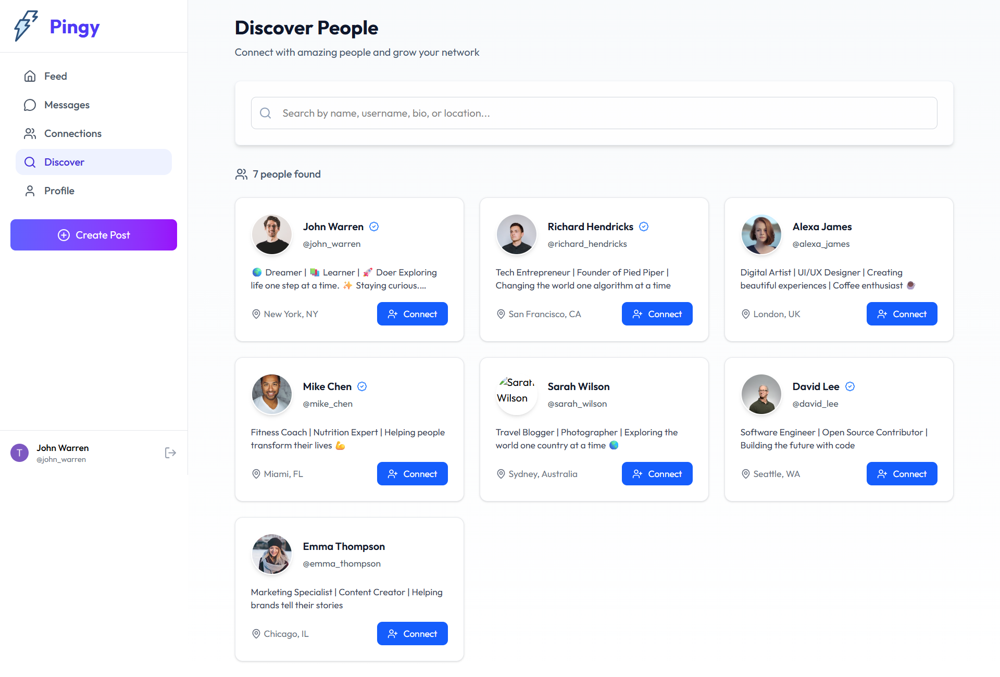 

- **Profile Browsing** - View user profiles, posts, and media

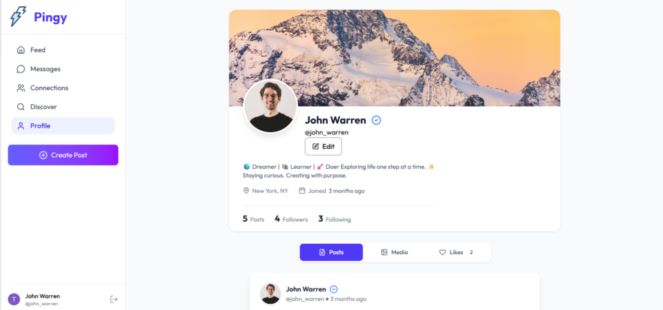 
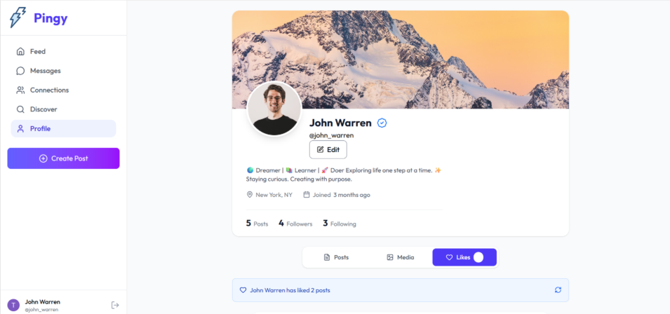

### 💬 Messaging & Communication

- **Real-time Messaging** - Instant chat functionality
- **Recent Messages** - Quick access to conversations

 

- **Message History** - View conversation 

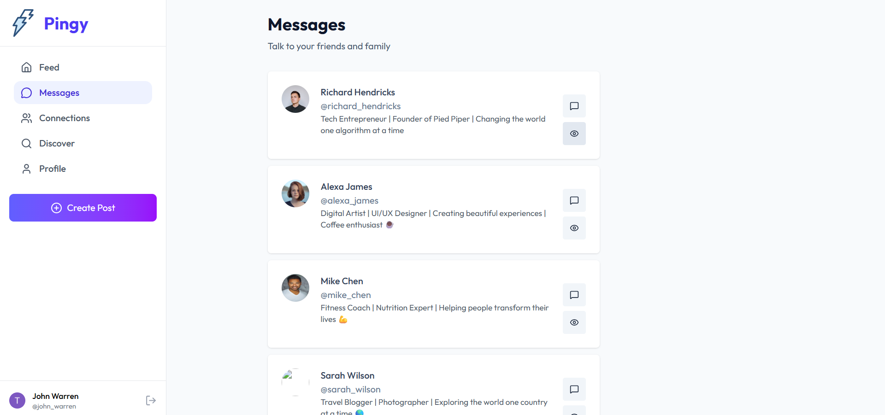 
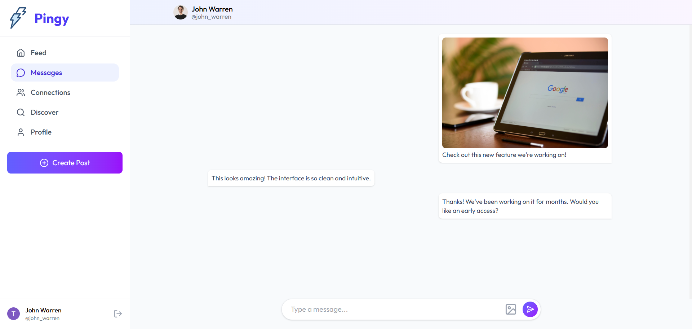 

### 🎯 Discovery & Exploration
- **Smart Search** - Find content and people across multiple criteria
- **Location-based Discovery** - Find people nearby

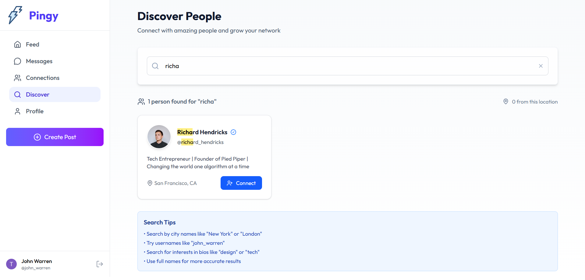 

- **Sponsored Content** - Curated sponsored posts in sidebar

 

- **Media Gallery** - Browse user photos and videos

### 👤 Profile Management

- **Customizable Profiles** - Edit bio, profile picture, and details

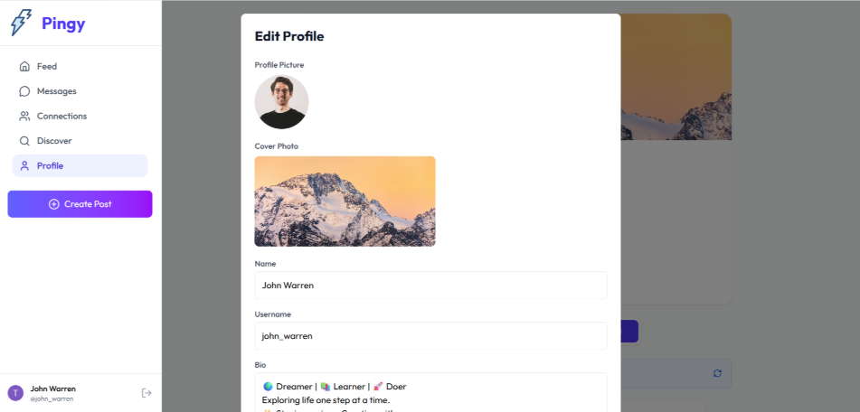

- **Post History** - View all shared posts and media

## Mobile View

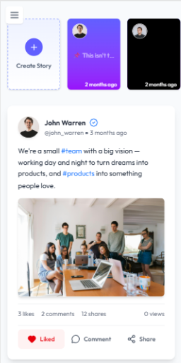 
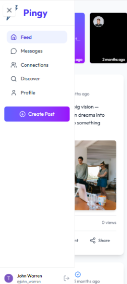 
